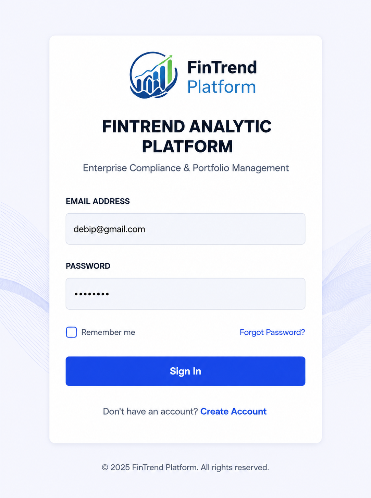
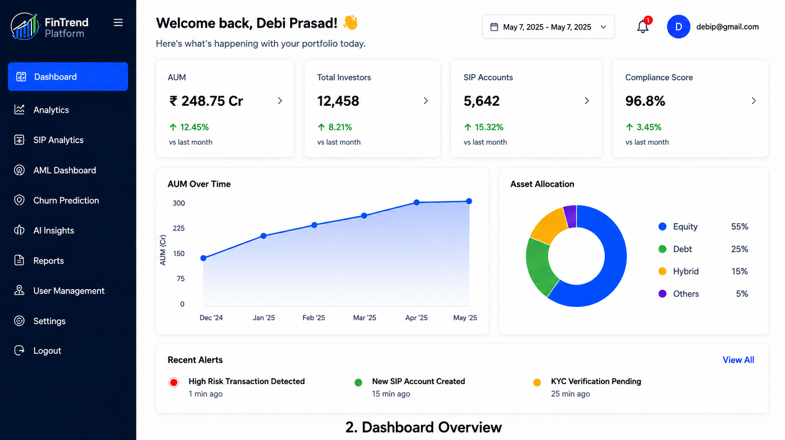
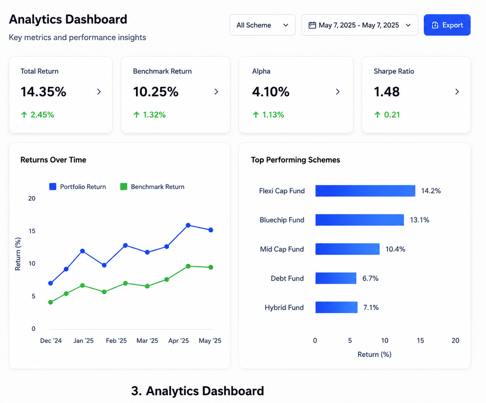
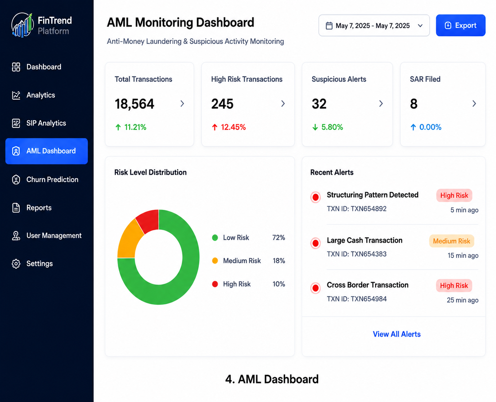
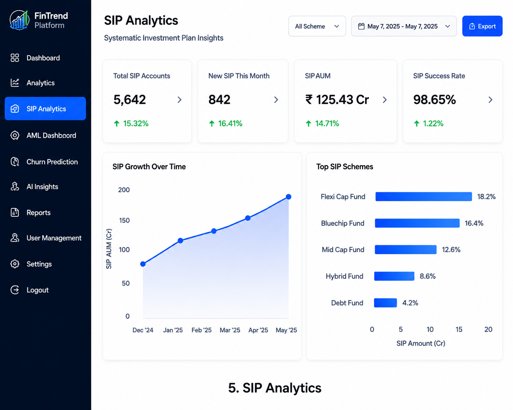
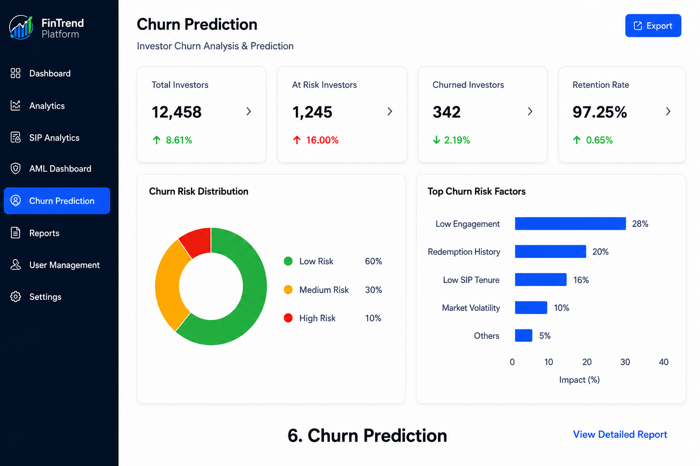
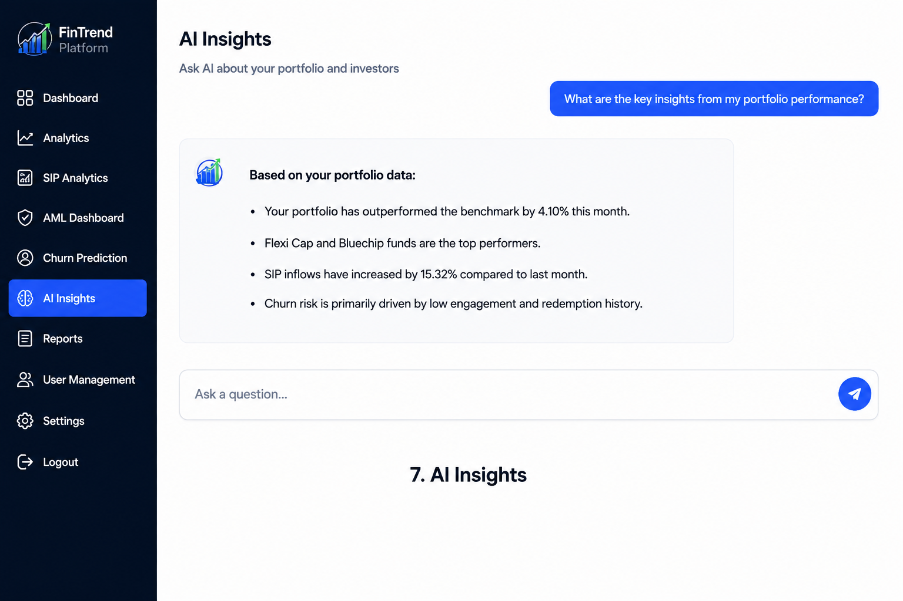

# 📊 FinTrend Analytics Platform

An AI-powered financial analytics platform developed during the **KFintech Training Program** to help Asset Management Companies (AMCs) monitor investments, analyze Assets Under Management (AUM), detect compliance risks, predict investor churn, and generate executive insights through a unified dashboard.

> **Note:** This repository showcases a collaborative team project developed by a team of **15 members** during the KFintech Training Program. It is maintained as part of my personal portfolio to demonstrate my learning and contribution. This repository does not claim sole authorship of the project.

---

# 🚀 Features

- 📈 Executive Dashboard
- 💰 Assets Under Management (AUM) Analytics
- 📊 SIP Analytics
- 🛡️ AML & Compliance Monitoring
- 🤖 AI-based Churn Prediction
- 🧠 AI Insights
- 📄 Report Generation
- 🔐 Secure Authentication

---

# 🛠️ Tech Stack

| Layer | Technology |
|--------|------------|
| Frontend | React.js, Vite |
| Backend | Node.js, Express.js |
| Database | PostgreSQL, SQLite |
| Machine Learning | Python |
| Charts | Chart.js |
| Authentication | JWT |
| Deployment | AWS |

---

# 📸 Application Screenshots

## Login Page



---

## Dashboard



---

## Analytics Dashboard



---

## AML Dashboard



---

## SIP Analytics



---

## Churn Prediction



---

## AI Insights



---

# 📂 Repository Structure

```text
fintrend-platform
│
├── README.md
└── fintrend-platform-main
    ├── backend
    ├── frontend
    ├── screenshots
    ├── PROJECT_REPORT.md
    ├── package.json
    └── ...
```

---

# ⚙️ Installation

## Clone Repository

```bash
git clone https://github.com/debiprasadtripathy2005/fintrend-platform.git
```

## Install Backend

```bash
cd fintrend-platform-main/backend
npm install
npm run dev
```

## Install Frontend

```bash
cd fintrend-platform-main/frontend
npm install
npm run dev
```

---

# 🔐 Security Features

- JWT Authentication
- Password Hashing
- Role-based Authorization
- Audit Logging
- Input Validation
- Secure REST API Communication

---

# 🚀 Future Enhancements

- Real-time Market Data Integration
- AI Investment Recommendations
- Advanced Fraud Detection
- Automated Regulatory Reporting
- Microservices Architecture
- Kubernetes Deployment
- Event-driven Processing

---

# 👥 Acknowledgement

This project was developed during the **KFintech Training Program** by a team of **15 members**.

The project idea and problem statement were provided by **KFintech**, and the implementation was completed collaboratively by the team.

This repository is maintained to showcase my contribution, learning, and full-stack development experience.

---

# 📄 License

This project is intended for **academic, demonstration, and portfolio purposes**.
